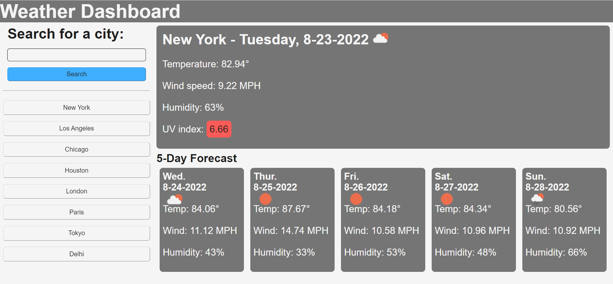

# Weather Dashboard
[Deployed Application]()

## Purpose

This web application provides the current and forecast weather for cities.

## Functionality

* When the user searches for a city the current weather and five day forecast of that city is provided

* After searching for a city the city's name, the current date, the temperature(in farienhiert), an icon representing the current weather conditions, wind speed, humidity, and UV index are displayed

* After searching for a city the date, the temperature(in farienhiert), an icon representing the weather conditions, wind speed, and humidity are displayed for the next five days

* A colored box around the UV index is displayed in green, yellow and red indicating whether the index is low, moderate, or high respectively

* Each city searched is added to the search history and appears on one of eight preset buttons below the main search feild

* Clicking on a preset button will immediately search the weather information for the city displayed on the button

* When the user enters an invalid search input (a term that includes digits or if the feild is blank) the they will be unable to submit the search

* When no result is found for a search the user is alerted and the search is not added to the search history

* The search history/preset buttons will populate when the page is refresed or first opened 

* The most recent searched city's weather information will be displayed when the page is opened or refreshed

## Application Preview

Here is a preview of the weather dashboard.

